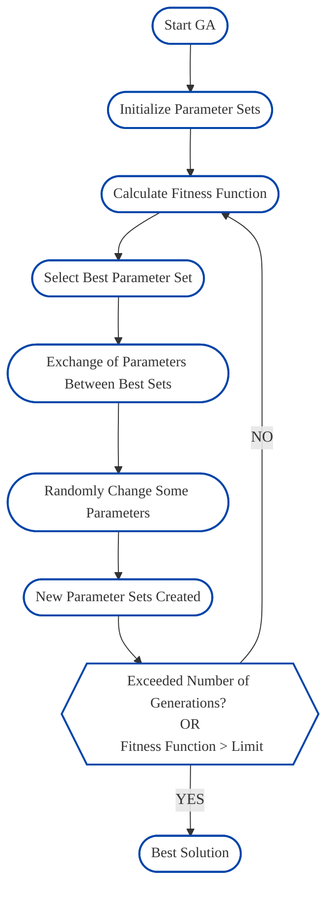

# MetalDock 

MetalDock is an open software tool that can dock organometallic compounds to proteins with parameters that have been obtained with a genetic algorithm. The library consists of open docking software (AutoDock) and open quantum software (ORCA) and can be used by anyone. Three options are available:

1) Dock organometallic compounds
2) Train the genetic algorithm on a dataset
3) Test the parameters obtained from the genetic algorithm


## Installation


## Dock organometallic compounds
MetalDock has as main function to dock organometallic compounds easily and reproducible. The user only has to supply:
1) xyz file of the compound 
2) pdb file of the protein/DNA/biomolecule 
3) input file consisting of the various parameters (see example_files directory) 

The program will use QM software to optimize the geometry, if specified, and will extract CM5 charges via a single point calculation. The script can run on three different QM software packages:
# 1) ADF 
To run ADF as QM engine the following environment variables need to be exported:
``` bash
export AMSHOME=/full/path/to/ams/ams2022
export AMSBIN=$AMSHOME/bin
export AMSRESOURCES=$AMSHOME/atomicdata
export SCMLICENSE=$AMSHOME/license.txt
```

Relativistic effects with ZORA

# 2) Gaussian
To run Gaussian as QM engine the following environment variables need to be exported
``` bash
export g16root=/full/path/to/gaussian/g16
```

Relativistic effects with DKH

# 3) ORCA (free)
To run ORCA as QM engine with correct parralelization the full path to the orca binary has to be exported with the following command:
``` bash
export ASE_ORCA_COMMAND='/full/path/to/orca/orca PREFIX.inp > PREFIX.out'
```

Relativistic effects with ZORA

##
The program will protonate the protein/DNA/biomolecule at the specified pH. It will then generate two .pdbqt files that will be used in the AutoDock4.2 scheme. The parameter file consisting of the added metal parameters will be automatically generated, and our own derived parameters will be used. If desired, the standard parameters can be overwritten.

A workflow for the docking procedure is schematically given below.


## Training procedure genetic algorithm 
The only requirements for an input are a xyz file of the compound, a pdb file of the protein and a input.ini file. 

