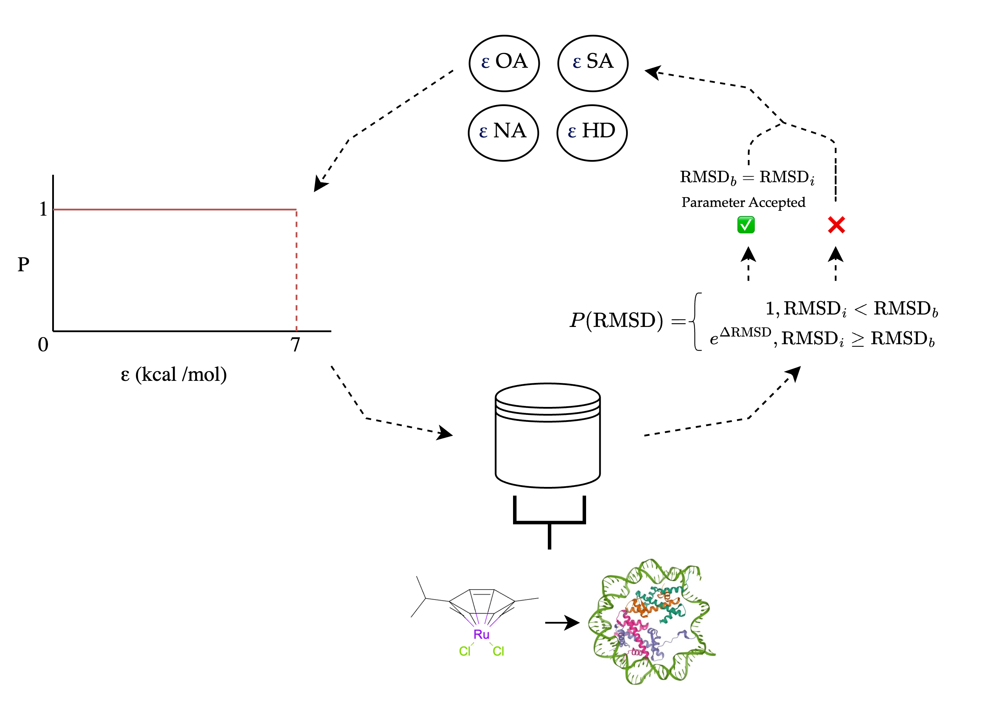

# Run MetalDock  

MetalDock is a Python program that performs molecular docking of metal-organic compounds. It uses a configuration file (**'.ini'**) to set various parameters for the docking procedure.

To dock organometallic compounds, follow these simple steps:

1. Prepare an XYZ file of the compound you want to dock.
2. Prepare a PDB file of the protein, DNA, or biomolecule you want to interact with.
3. Create an input file with the desired parameters. You can find examples in the **'input_examples'** directory of the GitHub repository.

## How to run MetalDock docking procedure?
You can run MetalDock with a single command. Simply provide the path to your input configuration file (e.g., input.ini) as shown below:

```bash
metaldock -i input.ini 
```

For a detailed description of the output directories and files please see the [output](output.md) chapter.

## What basis set and functional should I use?
Choosing the correct settings for the quantum mechanical calculation can be tricky. Luckily, there have been numerous reviews on this subject that can help you with choosing the correct settings for your system. I would like to recommend the following two papers, for the less experienced quantum chemistry users:

[Best-Practice DFT Protocols for Basic Molecular Computational Chemistry](https://onlinelibrary.wiley.com/doi/full/10.1002/ange.202205735)
[Which functional should I choose?](https://www.chem.uci.edu/~kieron/dft/pubs/RCFB08.pdf)

## Docking workflow
A workflow for the docking procedure is schematically given below.


## How to run Monte Carlo Optimisation scheme?
To parametrise your own parameters you will need to create a subdirectory named **'data_set'** in the directory where you are going to run MetalDock. Inside **'data_set'**, nam each subdirectory fo the protein metal-complex pair, e.g., **'protein_0'**, **'protein_1'**, and so on.

For each data point, run a separate calculation with MetalDock to ensure there are no errors during the optimsation scheme. After optimisation, you can keep the QM directory somewhere stored, but remove it from the data point directory, to preven excessive storage usage, as the subdirectories will be copied. 

Set the method to **'mc'** and fine-tune the docking paremeters according to your preference. 

Here's an schematic overview of the Monte Carlo optimisation procedure:



Each parameter is sequentially sampled from an equiprobable distribution. All complexes in the dataset are then docked and the average RMSD (Root Mean Square Deviation) is calculated. If the RMSD is lower than in the previous iteration, the parameter is accepted; otherwise, there is a probability of acceptance.

For more details, see the following paper.