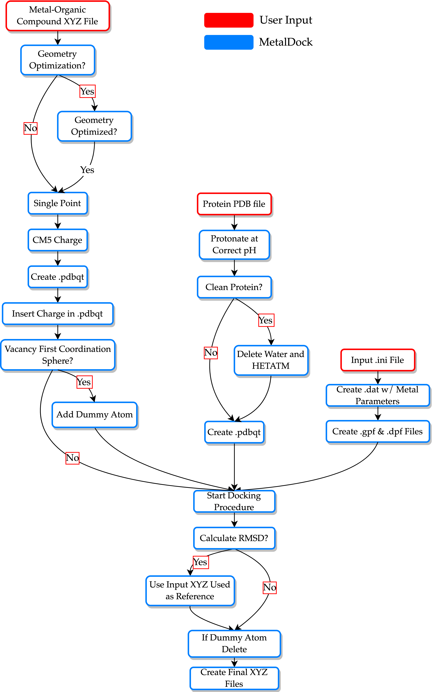

# Run MetalDock  

MetalDock is a Python program that performs molecular docking of metal-organic compounds. It uses a configuration file (**'.ini'**) to set various parameters for the docking procedure.

To dock organometallic compounds, follow these simple steps:

1. Prepare an XYZ file of the compound you want to dock.
2. Prepare a PDB file of the protein, DNA, or biomolecule you want to interact with.
3. Create an input file with the desired parameters. You can find examples in the **'input_examples'** directory of the GitHub repository.

## How to run MetalDock docking procedure?
You can run MetalDock with a single command. Simply provide the path to your input configuration file (e.g., input.ini) as shown below:

```bash
metaldock -i input.ini -m dock 
```

For a detailed description of the output directories and files please see the [output](output.md) chapter.

## What basis set and functional should I use?
Choosing the correct settings for the quantum mechanical calculation can be tricky. Luckily, there have been numerous reviews on this subject that can help you with choosing the correct settings for your system. I would like to recommend the following two papers, for the less experienced quantum chemistry users:

[Best-Practice DFT Protocols for Basic Molecular Computational Chemistry](https://onlinelibrary.wiley.com/doi/full/10.1002/ange.202205735)

[Which functional should I choose?](https://www.chem.uci.edu/~kieron/dft/pubs/RCFB08.pdf)

## Docking workflow
A workflow for the docking procedure is schematically given below.



## How to run Monte Carlo Optimisation scheme?
 
This protocol describes the steps to prepare input files for Monte Carlo parameter optimization after running the MetalDock protocol for each compound in your dataset.
 
### Prerequisites
- MetalDock installed and configured
- A dataset of compounds to be processed
- Completed MetalDock runs for each compound
 
### Step-by-Step Instructions
 
#### 1. Set Up the Data Directory
Create a directory where you are going to run the Monte Carlo optimization protocol in.
```bash
mc
cd mc
```
 
Create a dataset directory in the mc directory to store your dataset:
```bash
mkdir data_set
cd data_set
```
 
#### 2. Prepare Each Compound
For each compound, follow these steps:
 
1. Create a directory for the compound:
   ```bash
   mkdir compound_1
   ```
 
2. Copy and rename the required files from the MetalDock output:
   - **Ligand file**
     ```bash
     cp path/to/MetalDock/output/docking/ligand.pdbqt compound_1/compound_1.pdbqt
     ```
   - **Protein file**
     ```bash
     cp path/to/MetalDock/output/docking/protein.pdbqt compound_1/protein_1.pdbqt
     ```
   - **XYZ coordinate file**
     ```bash
     cp path/to/MetalDock/output/file_prep/ligand_c.xyz compound_1/compound_1_c.xyz
     ```
 
   > Replace `path/to/MetalDock/` with the actual directory where MetalDock output files are stored.
 
#### 3. Repeat for All Compounds
Repeat the above steps for each compound in your dataset, renaming directories and files accordingly (e.g., `compound_2`, `compound_3`, etc.).
 
#### 4. Create input.ini file
Create a monte_carlo.ini file in the mc directory.
 
#### 5. Run the Monte Carlo optimization
```bash
metaldock -i monte_carlo.ini -m mc  

Here's an schematic overview of the Monte Carlo optimisation procedure:


Each parameter is sequentially sampled from an equiprobable distribution. All complexes in the dataset are then docked and the average RMSD (Root Mean Square Deviation) is calculated. If the RMSD is lower than in the previous iteration, the parameter is accepted; otherwise, there is a probability of acceptance.

For more details, see the following paper.
